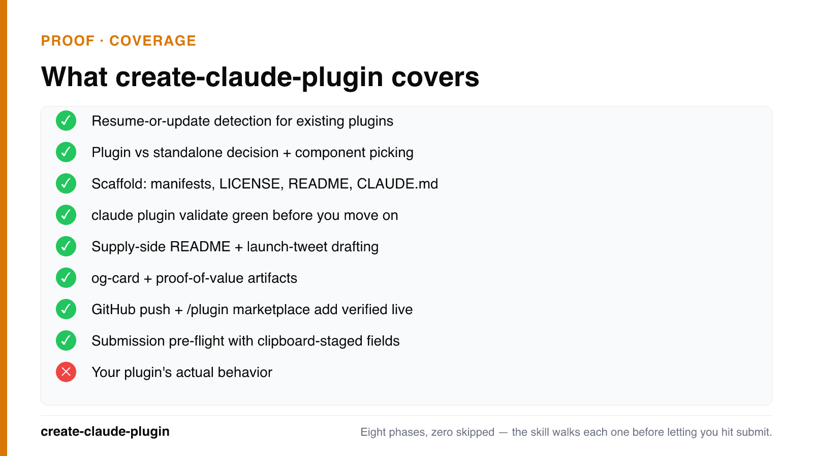

# create-claude-plugin

<p align="center">
  <a href="LICENSE"></a>
  <a href=".claude-plugin/plugin.json"></a>
  <a href="https://claude.com/product/claude-code"></a>
  <a href="https://github.com/codyhxyz/codyhxyz-plugins"></a>
</p>

> *A Claude plugin that ships Claude plugins. Yes, it's recursive. Someone had to do it.*

<p align="center">
  
</p>
<p align="center"><em>Eight phases, zero skipped — the skill walks each one before letting you hit submit.</em></p>

Other plugin guides explain what plugins are. This one walks you from "I have an idea" to "it's live in `claude-plugins-official`" without leaving Claude Code. It validates, runs the local test loop, does the Cowork portability check, pushes to GitHub, and fills out the submission form. You handle the judgment (naming, scoping, what it should actually say). The skill handles the plumbing.

## Before and after

Before: "I have a skill in `~/.claude/` and no idea how to share it."

After: plugin passes `claude plugin validate`, repo is live on GitHub, `/plugin marketplace add owner/repo` works in a fresh session, and the submission form is open in your browser with every field already on your clipboard. About 20 minutes.

## What you get

- A validated plugin that passes `claude plugin validate` and works in-session via `claude --plugin-dir`.
- A live GitHub repo with topics, a verified install flow, and `gh repo create` already done.
- A filled-in submission. Clipboard pre-loaded with every field the form asks for, browser opened to `claude.ai/settings/plugins/submit`, fields grouped by form page so you can paste and tab through.
- An automated Cowork smoke test. Most toolkits stop at `claude plugin validate`. This one drives the Cowork desktop app for you: Claude Code's Computer Use installs your plugin, runs your test prompt, and screenshots errors. No manual clicking. (macOS plus Pro/Max only; there's a manual fallback otherwise.)

## Examples

Example 1. "I have a code-review agent in `.claude/agents/` and I want to share it." The skill converts the agent file into a plugin layout, scaffolds `.claude-plugin/plugin.json` and `marketplace.json`, writes the README with install instructions, runs `claude plugin validate`, pushes to GitHub, and prints every submission field ready to paste.

Example 2. "Build me a plugin from scratch that bundles a skill and a PostToolUse hook." The skill picks the layout (skill at `skills/<name>/SKILL.md`, hook at `hooks/hooks.json`), inserts `${CLAUDE_PLUGIN_ROOT}` substitutions so the hook survives install, runs the local `claude --plugin-dir` test loop, then walks you through hosting and submission.

## Install

### Claude Code (recommended)

```
/plugin marketplace add codyhxyz/codyhxyz-plugins && /plugin install create-claude-plugin@codyhxyz-plugins
```

The `plugin@marketplace` format is `<plugin-name>@<marketplace-name>`. `codyhxyz-plugins` is my meta-marketplace — one `add`, every plugin I ship.

See the full [codyhxyz-plugins marketplace](https://github.com/codyhxyz/codyhxyz-plugins) for my other plugins.

### Manual install

```bash
mkdir -p ~/.claude/skills/create-claude-plugin
git clone https://github.com/codyhxyz/create-claude-plugin /tmp/ccp
cp -r /tmp/ccp/skills/create-claude-plugin/* ~/.claude/skills/create-claude-plugin/
```

## Usage

Ask Claude Code to make a plugin:

> "Help me make a Claude Code plugin out of this skill I have in my `.claude/` dir."

> "I want to publish my code-review agent to the official Claude marketplace."

> "Scaffold a new Claude plugin with a skill and a hook."

The skill activates on its own and walks through seven phases: decide, scaffold, build, test, document, host, submit.

## Pre-flighting an existing plugin

If you already have a plugin and want to check whether it's submission-ready:

```bash
./scripts/check-submission.sh /path/to/your/plugin
```

What it does:
1. Validates `plugin.json` has every field the submission form wants.
2. Checks the name is kebab-case, not reserved, not impersonating something else, and not already taken in `claude-plugins-official`.
3. Confirms your README has an `## Examples` section.
4. Runs `claude plugin validate` if you have it installed.
5. Copies every paste-ready field to your clipboard and opens the submission URL.

## Why this exists

Making a Claude plugin is maybe 20% mechanics and 80% judgment plus distribution. The CLI handles the mechanics. The existing docs explain what plugins are. Nothing closed the gap between "I have an idea" and "it's listed at `claude-plugins-official`, installable by anyone running `/plugin install`."

So: scripts where determinism matters, model where judgment matters. The script catches missing fields. The skill helps you figure out what those fields should say. Same shape as [create-chrome-extension](https://github.com/codyhxyz/create-chrome-extension).

## Related

- [create-chrome-extension](https://github.com/codyhxyz/create-chrome-extension) — same idea, Chrome Web Store instead of the Claude marketplace.
- create-claude-plugin (you're here) — `~/.claude/` skill to `claude-plugins-official`.

## Repository layout

```
create-claude-plugin/
├── .claude-plugin/
│   ├── plugin.json
│   └── marketplace.json
├── skills/
│   └── create-claude-plugin/
│       ├── SKILL.md                    # main orchestration skill
│       ├── reference/                  # load on demand
│       │   ├── plugin-manifest.md
│       │   ├── marketplace-manifest.md
│       │   ├── component-types.md
│       │   ├── hosting-options.md
│       │   └── submission-form.md
│       ├── templates/                  # copy + fill in
│       │   ├── plugin/                 # plugin.json, marketplace.json, README, LICENSE, CHANGELOG, .gitignore
│       │   ├── skill/SKILL.md
│       │   ├── agent/agent.md
│       │   └── hook/hooks.json
│       └── checklists/
│           ├── pre-publish.md
│           └── submission-ready.md
├── scripts/
│   └── check-submission.sh
├── ARCHITECTURE.md
├── README.md
├── LICENSE
├── CHANGELOG.md
└── .gitignore
```

## Contributing

Issues and PRs welcome. Stale doc links in the skill count as bugs.

## License

[MIT](LICENSE) © 2026 Cody Hergenroeder

---

<sub>Part of <a href="https://github.com/codyhxyz/codyhxyz-plugins"><b>codyhxyz-plugins</b></a> 🍋 — my registry of Claude Code plugins.</sub>
