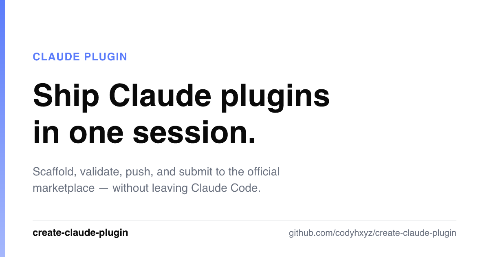

# create-claude-plugin

<p align="center">
  <a href="LICENSE"></a>
  <a href=".claude-plugin/plugin.json"></a>
  <a href="https://claude.com/product/claude-code"></a>
</p>

<p align="center"></p>

> *A Claude plugin that ships Claude plugins: The build-and-publish layer for the era of bespoke AI.*

Yes, it's recursive. Someone had to do it.

The other plugin guides explain what plugins *are*. This one walks you from "I have an idea" to "it's live in `claude-plugins-official`" without leaving Claude Code. Validation, local test loop, Cowork portability check, GitHub push, and the submission form's exact fields — all automated. You handle the judgment (naming, scoping, what it should *say*). The skill handles the plumbing.

## Before → After

**Before:** "I have a skill in `~/.claude/` and no idea how to share it."

**After:** Plugin validated with `claude plugin validate`. Repo live on GitHub. `/plugin marketplace add owner/repo` verified in a fresh session. Submission form open in your browser with every field already on your clipboard. ~20 minutes.

## What you walk away with

- **A validated plugin** — passes `claude plugin validate`, tested in-session via `claude --plugin-dir`
- **A live GitHub repo** — `gh repo create` + topics + one-command install flow verified end-to-end
- **A filled-in submission** — clipboard pre-loaded with every field the form asks for, browser opened to `claude.ai/settings/plugins/submit`, fields grouped by form page so you can paste-tab through
- **A Cowork smoke-test, automated** — most toolkits stop at `claude plugin validate`; this one drives the Cowork desktop app for you. Claude Code's Computer Use installs your plugin, runs your test prompt, and screenshots errors — no manual clicking. (macOS + Pro/Max; manual fallback otherwise.)

## Demo

> 🎬 *GIF placeholder — the Phase 7 handoff: skill finishes → clipboard staged → submission URL opens → every field grouped and paste-ready. To see it now, run `./scripts/check-submission.sh <plugin-path>` on a submission-ready plugin.*

## Examples

> **Example 1** — "I have a code-review agent in `.claude/agents/` and I want to share it." The skill converts the agent file into a plugin layout, scaffolds `.claude-plugin/plugin.json` + `marketplace.json`, writes the README with install instructions, runs `claude plugin validate`, pushes to GitHub, and prints every submission-form field ready to paste.

> **Example 2** — "Build me a plugin from scratch that bundles a skill and a PostToolUse hook." Skill picks the right layout (skill at `skills/<name>/SKILL.md`, hook at `hooks/hooks.json`), inserts `${CLAUDE_PLUGIN_ROOT}` substitutions so the hook survives install, runs the local `claude --plugin-dir` test loop, then guides hosting + submission.

## Install

### Claude Code (recommended)

```
/plugin marketplace add codyhxyz/create-claude-plugin
/plugin install create-claude-plugin@create-claude-plugin
```

The `plugin@marketplace` format is `<plugin-name>@<marketplace-name>`; for single-plugin repos like this one the two are identical by convention, which is why the name appears twice.

### Manual install

```bash
mkdir -p ~/.claude/skills/create-claude-plugin
git clone https://github.com/codyhxyz/create-claude-plugin /tmp/ccp
cp -r /tmp/ccp/skills/create-claude-plugin/* ~/.claude/skills/create-claude-plugin/
```

## Usage

Ask Claude Code to make a plugin:

> "Help me make a Claude Code plugin out of this skill I have in my `.claude/` dir."

> "I want to publish my code-review agent to the official Claude marketplace."

> "Scaffold a new Claude plugin with a skill and a hook."

The skill activates automatically and walks you through seven phases: decide → scaffold → build → test → document → host → submit.

## Pre-flighting an existing plugin

If you already have a plugin and just want to verify it's submission-ready:

```bash
./scripts/check-submission.sh /path/to/your/plugin
```

The script:
1. Validates `plugin.json` has every field the submission form needs
2. Checks the name is kebab-case, not reserved, not impersonating, and **not already taken in `claude-plugins-official`**
3. Confirms your README has an `## Examples` section
4. Runs `claude plugin validate` if available
5. Copies every paste-ready field to your clipboard and opens the submission URL

## Why this exists

Making a Claude plugin is 20% mechanics and 80% judgment + distribution. The CLI (`claude plugin validate`) handles the mechanics. The other docs explain what plugins *are*. Nobody closes the loop from "I have an idea" to "it's listed at `claude-plugins-official`, installable by anyone running `/plugin install`."

Like [create-chrome-extension](https://github.com/codyhxyz/create-chrome-extension), this leans on **scripts where determinism matters and the model where judgment matters.** The script catches missing fields. The skill helps you decide what those fields should say.

## Part of the family

`create-claude-plugin` is one of a family of build-and-publish tools for the era of bespoke software. Each sibling solves the same shape of problem — an idea that never leaves the folder it was built in — for a different medium.

- **[create-chrome-extension](https://github.com/codyhxyz/create-chrome-extension)** — build-and-publish for Chrome extensions. Idea → Web Store, end-to-end.
- **create-claude-plugin** *(you're here)* — build-and-publish for Claude plugins. `~/.claude/` skill → `claude-plugins-official`, end-to-end.

## Repository layout

```
create-claude-plugin/
├── .claude-plugin/
│   ├── plugin.json
│   └── marketplace.json
├── skills/
│   └── create-claude-plugin/
│       ├── SKILL.md                    # main orchestration skill
│       ├── reference/                  # load on demand
│       │   ├── plugin-manifest.md
│       │   ├── marketplace-manifest.md
│       │   ├── component-types.md
│       │   ├── hosting-options.md
│       │   └── submission-form.md
│       ├── templates/                  # copy + fill in
│       │   ├── plugin/                 # plugin.json, marketplace.json, README, LICENSE, CHANGELOG, .gitignore
│       │   ├── skill/SKILL.md
│       │   ├── agent/agent.md
│       │   └── hook/hooks.json
│       └── checklists/
│           ├── pre-publish.md
│           └── submission-ready.md
├── scripts/
│   └── check-submission.sh
├── ARCHITECTURE.md
├── README.md
├── LICENSE
├── CHANGELOG.md
└── .gitignore
```

## Contributing

Issues and PRs welcome — stale doc links in the skill count as bugs.

## License

[MIT](LICENSE) © 2026 Cody Hergenroeder
